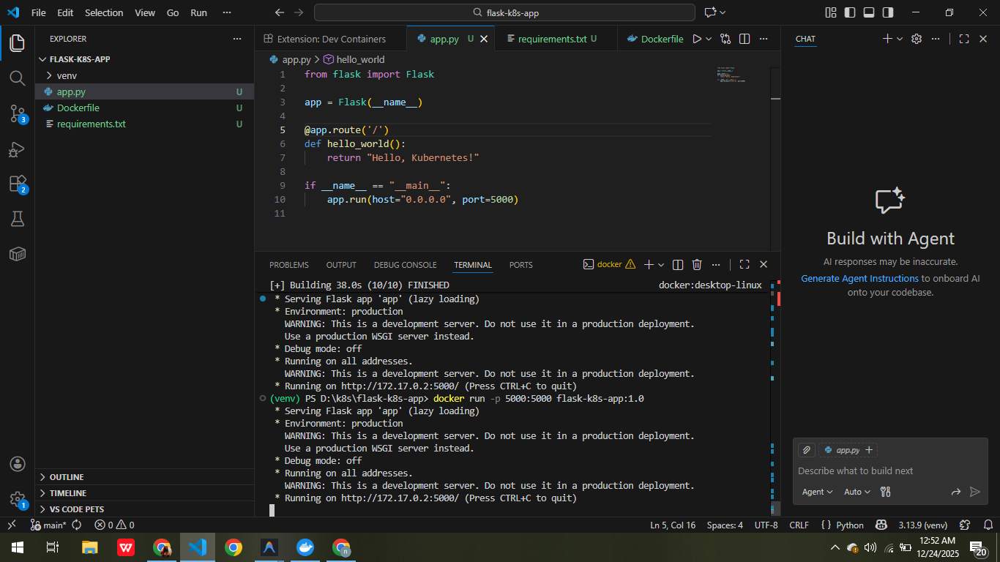
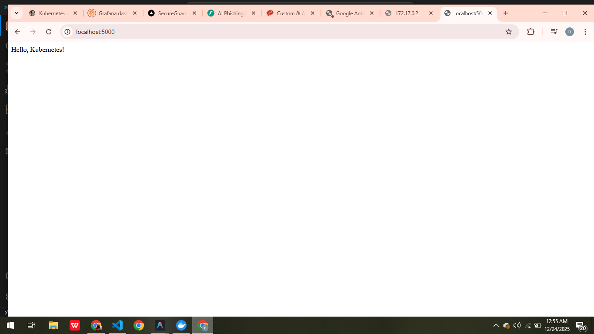
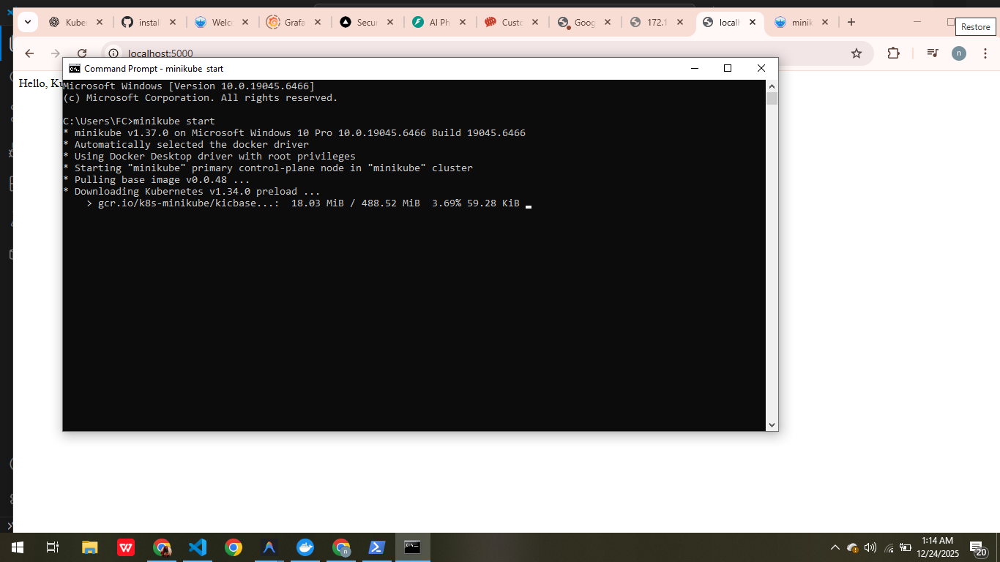
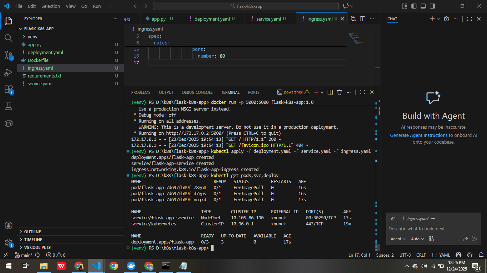
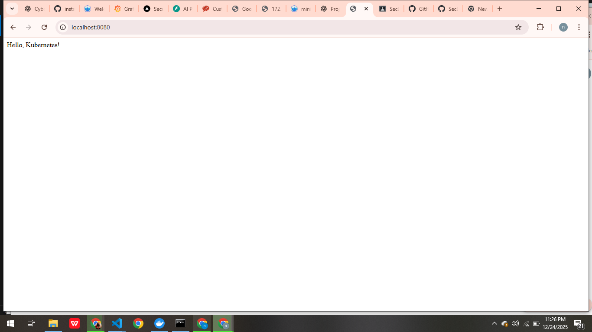
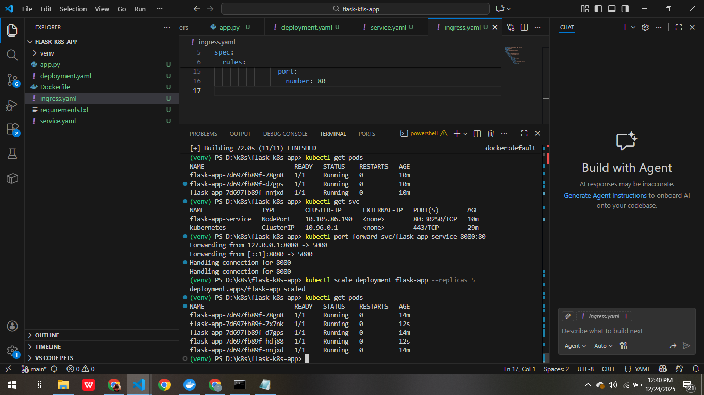

### Flask Kubernetes App

This is a simple Flask web application deployed on a Kubernetes cluster using Minikube (or any other Kubernetes setup). The application serves a "Hello, Kubernetes!" message when accessed via the exposed service.

### Prerequisites

- **Minikube** or any Kubernetes cluster (e.g., GKE, EKS, AKS)
- **kubectl** installed and configured to interact with your cluster
- **Docker** installed to build and load Docker images
- **PowerShell** (for Windows users)

### Screenshots

Here’s a screenshot of the application running:










### Setup and Installation

## Step 1: Clone the Repository

Clone this repository to your local machine:

``` git clone <repository-url>
cd flask-k8s-app
``` 

## Step 2: Build Docker Image

Ensure you are in the correct directory where the Dockerfile and app.py are located. Build the Docker image for your Flask app:

``` 
docker build -t flask-k8s-app:1.0 

```

If you're using Minikube, load the Docker image into the Minikube environment:

```
eval $(minikube -p minikube docker-env)
docker build -t flask-k8s-app:1.0 .
minikube image load flask-k8s-app:1.0
```
### Step 3: Start Minikube (If using Minikube)

Start Minikube to set up the local Kubernetes cluster:

```
 minikube start

```
### Step 4: Apply Kubernetes Manifests

Ensure the Kubernetes manifests (deployment.yaml, service.yaml) are correct and apply them:

``` 
kubectl apply -f deployment.yaml -f service.yaml
```

This will create the deployment and service on your Minikube Kubernetes cluster.

### Step 5: Expose the Service

If you're not using Ingress, use kubectl port-forward to expose the application:

``` 
kubectl port-forward svc/flask-app-service 8080:80
```

Now you can access the app at http://localhost:8080.

### Step 1: Clone the repository
```git clone <repository-url>
cd flask-k8s-app
```

### Step 2: Build the Docker image
```
docker build -t flask-k8s-app:1.0 
```

### Step 3: If using Minikube, set Docker environment to Minikube's Docker daemon
```eval $(minikube -p minikube docker-env)  # For Unix-based systems (Linux/macOS)
```
### For PowerShell (Windows):
```
minikube -p minikube docker-env | Invoke-Expression
```

### Step 4: Load Docker image into Minikube (if using Minikube)
```
minikube image load flask-k8s-app:1.0 
```

### Step 5: Start Minikube (if not already started)
```
 minikube start
```

### Step 6: Apply Kubernetes manifests
```
kubectl apply -f deployment.yaml -f service.yaml
```

### Step 7: Expose the service (if not using Ingress)
```
kubectl port-forward svc/flask-app-service 8080:80
```

### Step 8: Verify Pod Status
```
kubectl get pods
```

### Step 9: Check Services
```
kubectl get svc
```

### Step 10: Check the status of Minikube
```
minikube status
```

### Step 11: If you encounter "ErrImagePull" issue, ensure the image is built and loaded into Minikube:
```
docker images  # Verify the image is built
minikube image load flask-k8s-app:1.0  # Load into Minikube
```

### Step 12: If Pods are not running or stuck in "ErrImagePull", check the logs:
```
kubectl describe pod <pod-name>  # Detailed pod status
kubectl logs <pod-name>         # Check logs for errors

```

### Step 13: If the application is not accessible, check the local network settings and logs:
```
kubectl logs <pod-name>
kubectl describe pod <pod-name>
```

### Step 14: If Minikube fails to start, delete and recreate the cluster:
```
minikube delete
minikube start
```

### Step 15: Set the correct Kubernetes context for kubectl
```
kubectl config use-context minikube
```

### Step 16: Access the application in your browser
### Open the browser and go to:
```
http://localhost:8080
```

### Clean Up: To stop and delete the Minikube cluster when you're done:
```
minikube stop
minikube delete
```
